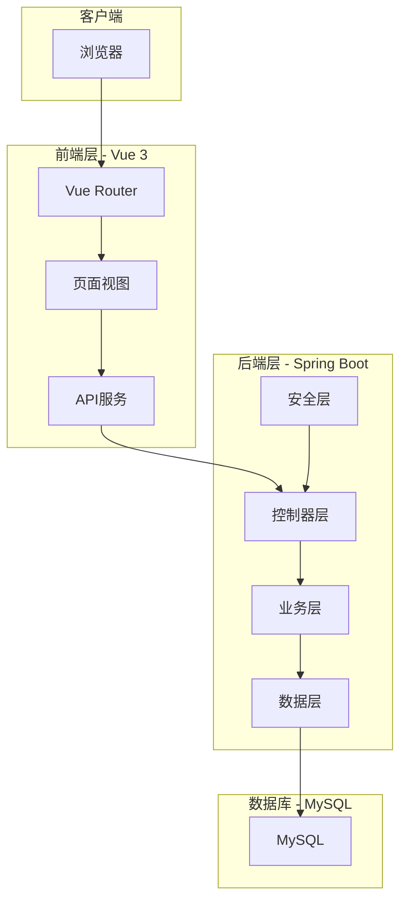
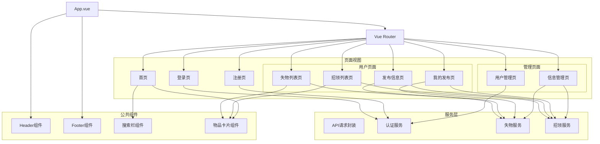
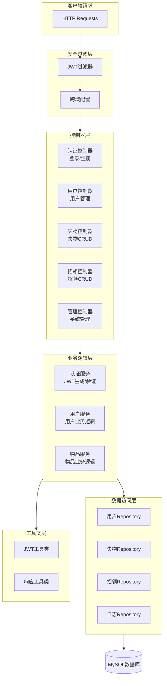
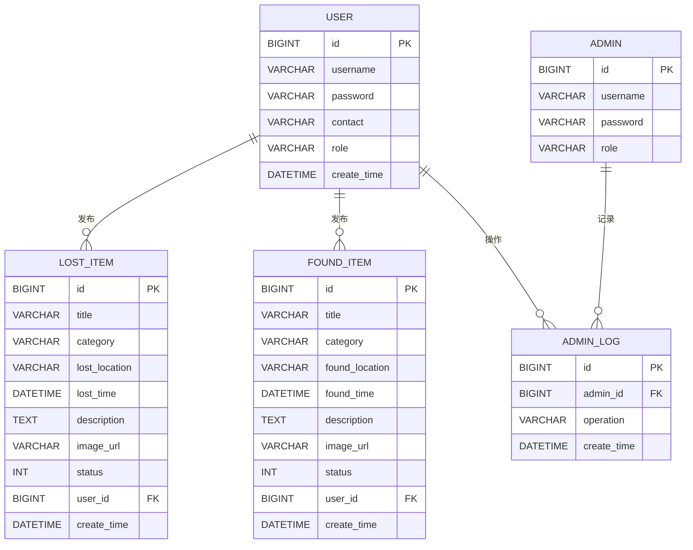
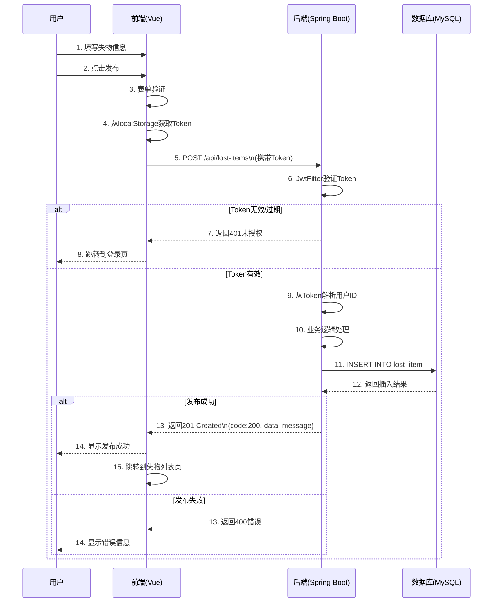
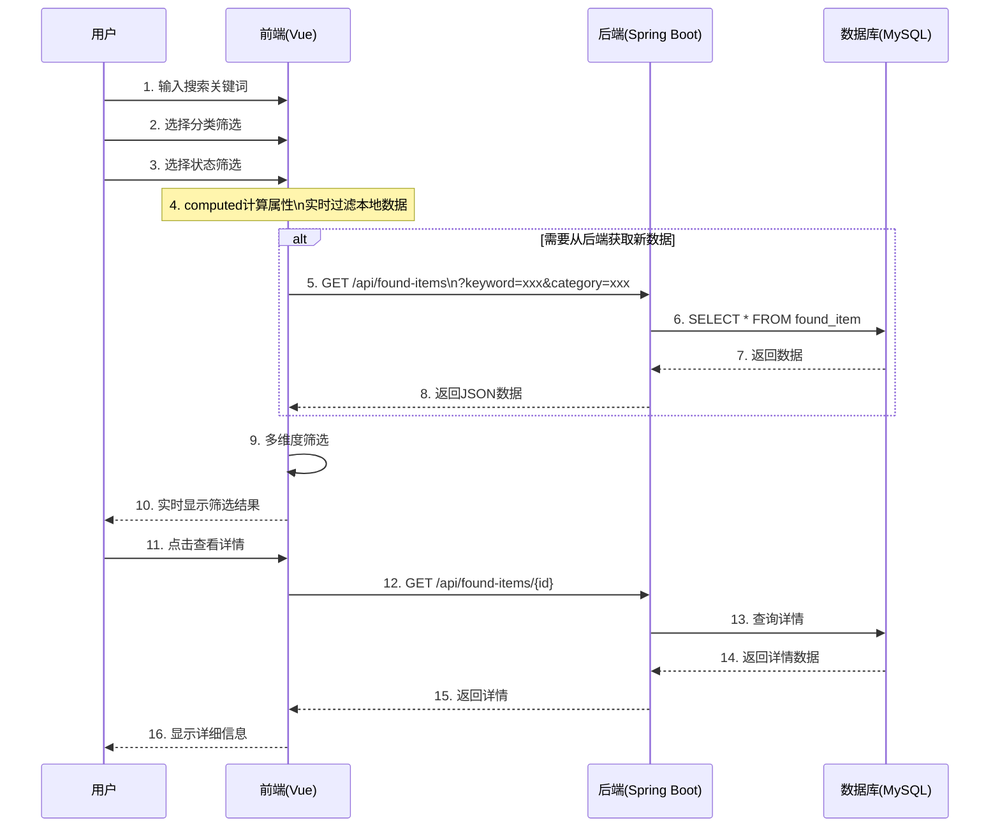
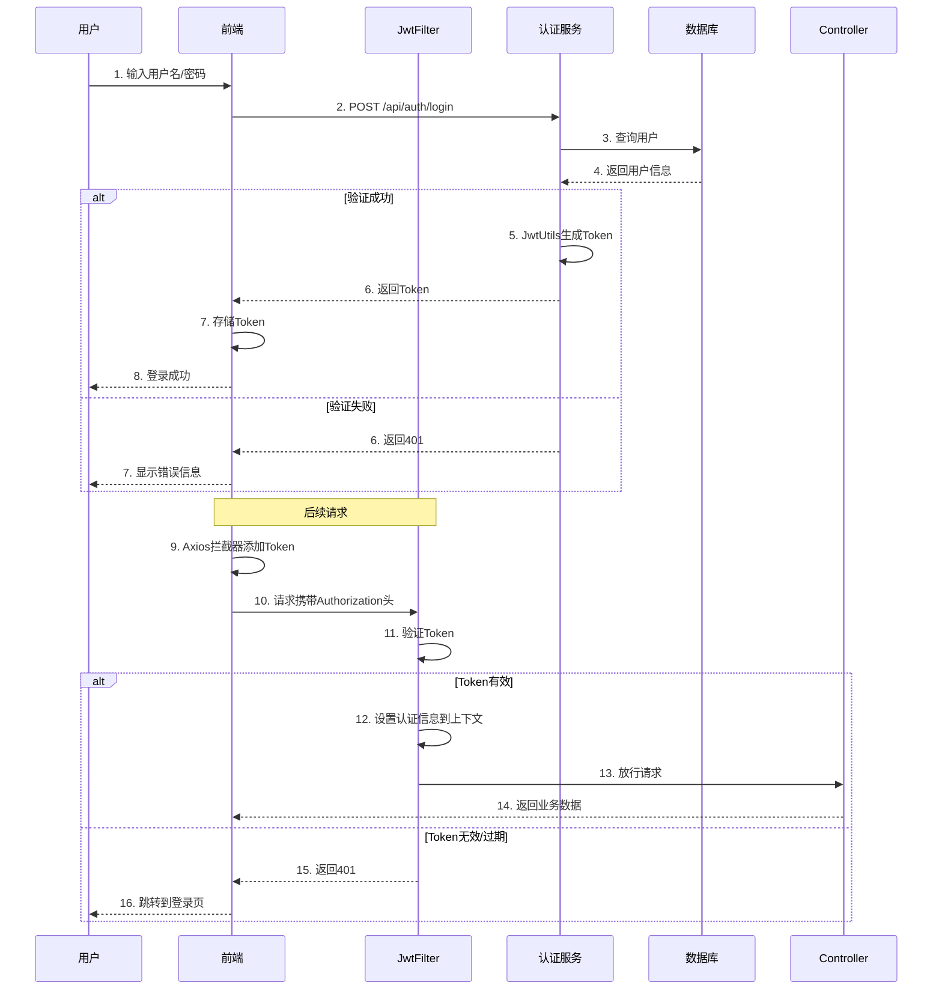
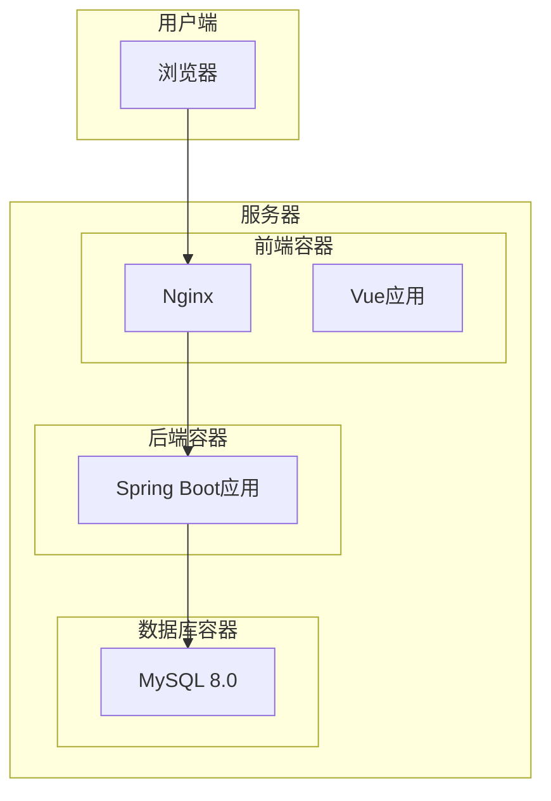

# 校园失物招领系统 - 架构设计文档

## 1. 系统整体架构图

---

## 2. 前端架构图（页面/组件结构）

---

## 3. 后端架构图（服务/模块划分）

---

## 4. 数据库ER图

---

## 5. 系统交互流程图（用户发布失物信息）

---

## 6. 系统交互流程图（用户搜索招领信息）

---

## 7. 系统交互流程图（JWT认证流程）

---

## 8. 部署架构图

