# 校园失物招领系统结课大作业文档

## 1. 文档说明

- 文档用途：作为课程结课大作业的项目总结文档，覆盖本项目从界面设计、架构设计、接口设计、前后端实现、测试、CI/CD、安全、Docker 到监控配置的完整开发过程。
- 文档范围：本文档只描述当前仓库中已经实现并可由代码、配置文件或测试用例验证的内容。
- 章节负责人标注方式：每章开头明确标注主要负责人，便于对应课程作业分工。

## 2. 项目概述

负责人：孔欣然、王琰

### 2.1 项目背景

校园中物品丢失与拾获信息往往分散在微信群、QQ群、公告栏等多个渠道，信息发布形式不统一，检索效率低，且缺少持续更新机制。失主很难在短时间内从大量零散消息中找到与自己相关的信息，拾到物品的同学也缺少一个规范、可信且便捷的发布渠道。基于这一现实问题，我们设计并实现了一个面向校园场景的失物招领系统，希望通过前后端分离架构，将失物信息发布、招领信息发布、用户身份管理、管理员审核与 AI 辅助匹配整合到一个统一平台中。

### 2.2 项目目标

本项目的目标不是做一个单一页面展示系统，而是完成一次相对完整的软件开发流程实践。具体而言，我们希望借助课程分阶段作业，逐步完成需求分析、原型设计、系统架构设计、数据库建模、接口设计、前后端实现、测试、自动化集成、安全检查、容器化部署与基础监控，从而形成一套能够运行、能够测试、能够持续集成、能够被后续维护的校园失物招领应用。

### 2.3 团队成员与主要分工

| 姓名 | 学号 | 主要职责 |
| --- | --- | --- |
| 孔欣然 | 2312190201 | 后端架构、数据库设计、JWT 认证、核心接口实现、后端测试、CI/CD 后端配置、安全审查、Docker 后端与监控 |
| 王琰 | 2312190223 | UI 设计、前端架构、页面与组件开发、前端测试、AI 功能集成、CI/CD 前端配置、Docker 前端与监控 |

### 2.4 开发过程总览

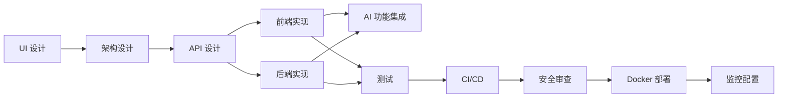
「本图由AI辅助生成，经人工审核修改」

上图反映了本课程作业的主线逻辑。我们不是先一次性完成全部功能，而是随着每次作业逐步补齐一个软件项目真正需要经历的阶段，并在后续阶段不断回过头修正前面阶段产生的问题，例如接口规范、测试环境、容器健康检查、敏感信息管理等。

## 3. 需求分析与界面设计

负责人：孔欣然、王琰

### 3.1 功能需求梳理

在项目初期，我们先从真实校园场景出发梳理用户需求，而不是直接开始编码。经过讨论后，系统围绕三类角色组织功能：

1. 普通用户：完成注册、登录、发布失物、发布招领、查看列表、查看详情、修改本人发布内容、更新物品状态、查看个人信息。
2. 管理员：查看平台用户、查看全站失物与招领信息、删除违规内容、调整用户角色、查看平台统计信息。
3. 系统维护者：通过测试、CI、Docker 与监控手段保障项目可运行、可验证、可维护。

在此基础上，我们确定了系统必须具备的核心页面，包括登录页、注册页、首页、失物列表页、招领列表页、详情页、发布页、个人中心页与管理员管理页。所有后续代码实现都围绕这些页面展开，没有在结课文档中描述任何代码库中不存在的页面或功能。

### 3.2 界面设计原则

界面设计阶段没有简单停留在“把页面画出来”这一层面，而是重点确定了统一的视觉规范与交互规范。颜色上采用青绿色作为主色、浅蓝色作为辅助色、橙色作为强调色，以保证界面整体清晰、友好且具有一定识别度。交互层面则统一约定了按钮反馈、卡片悬停、表单校验提示、角色跳转逻辑等行为规则，避免后续开发中不同页面风格不一致。

### 3.3 原型设计产出

本阶段的主要产出包括页面原型、设计说明和交互说明。通过原型先行的方式，我们减少了后期返工量，也让前后端在编码前对页面字段和跳转关系形成一致认识。

- 登录页原型
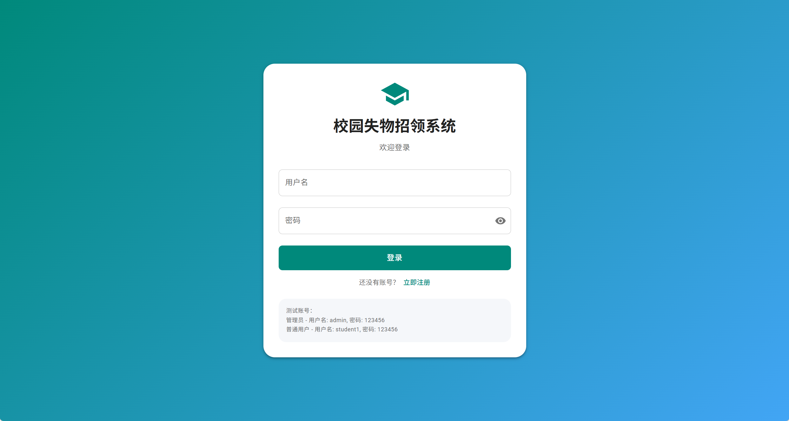
- 注册页原型
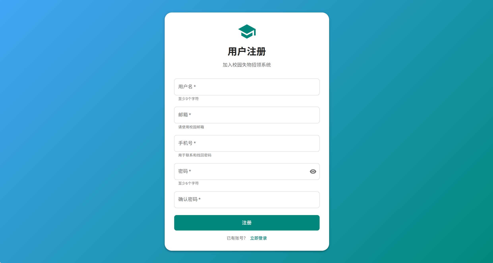
- 普通用户首页原型
.png)
- 管理员用户首页原型
.png)
- 失物列表与招领列表原型
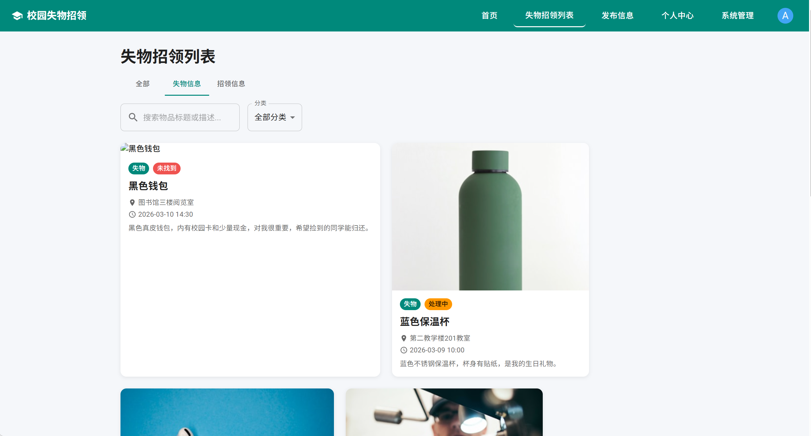
- 个人中心页面原型
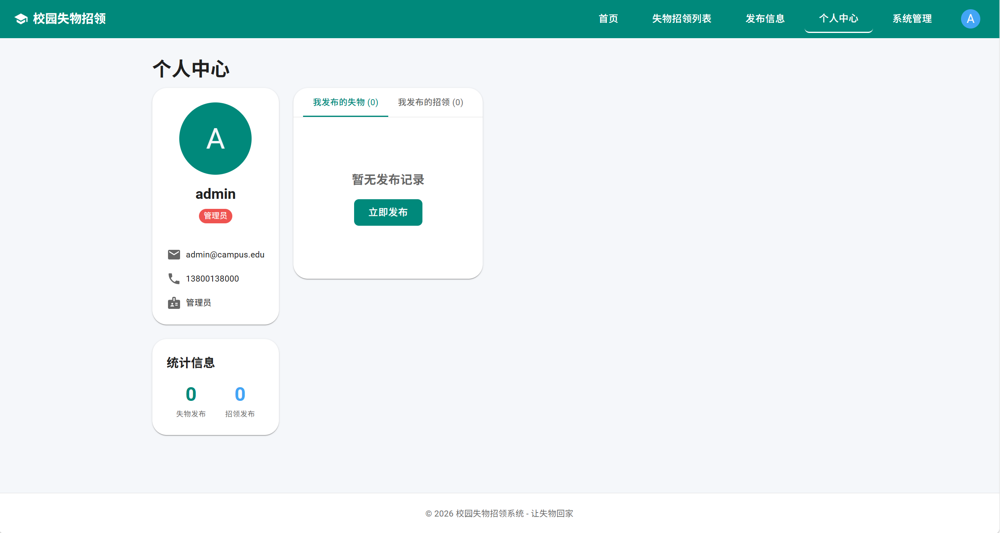
- 失物与招领发布页原型
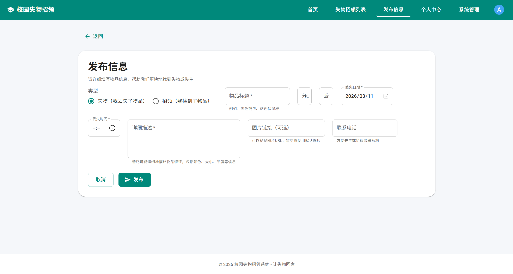
- 系统管理页面原型
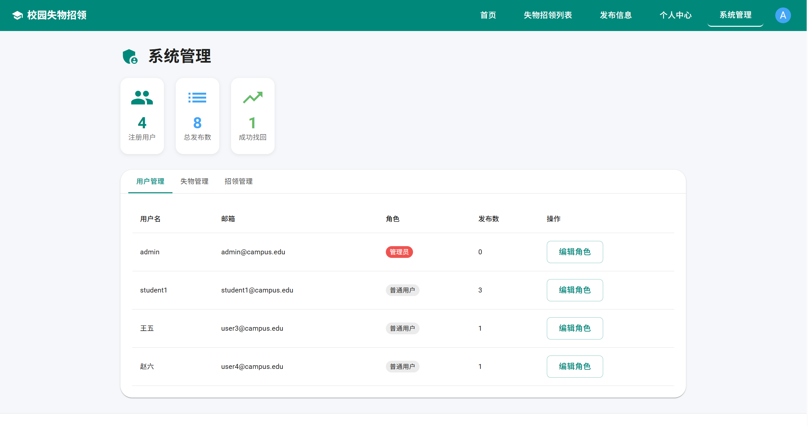

## 4. 架构设计与技术选型

### 4.1 总体架构

本项目采用典型的前后端分离架构。前端使用 Vue 3 负责页面渲染、路由控制和用户交互；后端使用 Spring Boot 负责认证、业务逻辑、数据访问和接口输出；数据库使用 MySQL 持久化用户、失物与招领数据。在部署阶段，前端通过 Nginx 提供静态资源访问，后端单独以 Spring Boot 应用方式运行，数据库使用独立容器。

### 4.2 前端架构

负责人：王琰

前端的核心结构由路由层、页面层、组件层和 API 封装层组成。路由使用 `vue-router` 管理页面跳转，页面位于 `frontend/src/views`，通用组件位于 `frontend/src/components`，网络请求统一封装在 `frontend/src/api`。这种设计保证了“页面负责展 示与交互，API 层负责请求封装，路由负责访问控制”，使代码组织更加稳定。

当前代码中，主要路由包括：

- `/login`：登录页
- `/register`：注册页
- `/home`：主页
- `/profile`：个人中心
- `/lost_item/list`：失物列表
- `/lost_item/new`：发布失物
- `/lost_item/:id`：失物详情
- `/lost_item/edit/:id`：编辑失物
- `/found`：招领列表
- `/found/publish`：发布招领
- `/found/:id`：招领详情
- `/admin`、`/admin/users`、`/admin/lost-items`、`/admin/found-items`：管理员功能页

前端路由守卫根据 `token` 和 `role` 完成基础访问控制，未登录用户不能进入受保护页面，普通用户也不能进入管理员页面。

### 4.3 后端架构

负责人：孔欣然

后端采用分层设计，主要包含以下四层：

1. Controller 层：负责接收请求与返回结果，例如 `UserController`、`LostItemController`、`FoundItemController`、`AdminController`、`ProfileController`、`AIController`、`HealthController` 与 `MetricsController`。
2. Service 层：负责业务逻辑处理，例如失物信息发布、招领信息筛选、所有权校验、AI 匹配准备等。
3. Repository 层：基于 Spring Data JPA 完成数据库访问。
4. Security 层：由 `SecurityConfig`、`JwtFilter` 和 `JwtUtils` 组成，负责认证与接口访问控制。

这种分层方式一方面降低了控制器代码的复杂度，另一方面也为单元测试和接口测试提供了更好的切入点。

### 4.4 技术选型与来源

负责人：共同完成

下表列出项目中主要第三方库、版本及来源。

| 类别 | 名称 | 版本 | 用途 | 来源 |
| --- | --- | --- | --- | --- |
| 前端框架 | Vue | 3.5.24 | 页面开发与响应式状态管理 | https://vuejs.org/ |
| 路由 | Vue Router | 4.6.4 | 前端路由管理 | https://router.vuejs.org/ |
| UI 组件库 | Element Plus | 2.13.0 | 表单、按钮、弹窗等 UI 组件 | https://element-plus.org/ |
| HTTP 客户端 | Axios | 1.13.2 | 前后端接口通信 | https://axios-http.com/ |
| 构建工具 | Vite | 7.2.4 | 前端开发与构建 | https://vite.dev/ |
| 前端测试 | Vitest | 4.1.5 | 前端单元测试与覆盖率 | https://vitest.dev/ |
| 后端框架 | Spring Boot | 2.6.13 | 后端应用框架 | https://spring.io/projects/spring-boot |
| 安全框架 | Spring Security | 随 Spring Boot BOM 管理 | 接口认证与授权 | https://spring.io/projects/spring-security |
| 数据访问 | Spring Data JPA | 随 Spring Boot BOM 管理 | ORM 与数据访问 | https://spring.io/projects/spring-data-jpa |
| JWT 库 | JJWT | 0.9.1 | Token 生成与解析 | https://github.com/jwtk/jjwt |
| 数据库 | MySQL | 8.0 | 业务数据持久化 | https://www.mysql.com/ |
| 测试数据库 | H2 | 随依赖管理 | CI 和测试环境数据库 | https://www.h2database.com/ |
| 日志编码 | logstash-logback-encoder | 7.3 | 结构化 JSON 日志输出 | https://github.com/logfellow/logstash-logback-encoder |
| 容器运行 | Docker | 未固定单独版本 | 镜像构建与部署 | https://www.docker.com/ |
| Web 服务器 | Nginx | `nginx:alpine` | 前端静态资源托管 | https://nginx.org/ |
| 自动化平台 | GitHub Actions | 云服务 | CI/CD 与安全扫描 | https://docs.github.com/actions |

「本节由AI辅助生成，经人工审核修改」

## 5. 数据库设计

负责人：孔欣然

### 5.1 数据建模思路

数据库设计围绕“用户发布内容”这一核心关系展开。系统并没有人为引入复杂的多表关联，而是优先保证课程项目阶段的可实现性和数据结构清晰度。最终，我们保留了三张核心业务表：`user`、`lost_item`、`found_item`。其中，用户与失物、用户与招领分别是一对多关系。

### 5.2 核心数据表说明

1. `user`：保存用户名、加密后的密码、联系方式、角色和注册时间。
2. `lost_item`：保存失物标题、类别、地点、时间、描述、图片地址、状态、发布者与发布时间。
3. `found_item`：保存招领标题、类别、地点、时间、描述、图片地址、状态、发布者与发布时间。

这三张表已经在实体类 `User`、`LostItem` 与 `FoundItem` 中落地实现，数据访问则由 `UserRepository`、`LostItemRepository` 与 `FoundItemRepository` 提供支持。

### 5.3 设计取舍

在数据库设计中，我们刻意保持了核心结构简洁。课程项目更重视完整开发流程，因此我们优先保证“表结构足以支撑所有已实现功能”，而不是过度设计复杂实体关系。例如，AI 匹配结果并未持久化到独立表中，而是采用实时调用模型、即时返回结果的方式，这样既降低了设计复杂度，也更符合当前实现规模。

- 数据库 ER 图
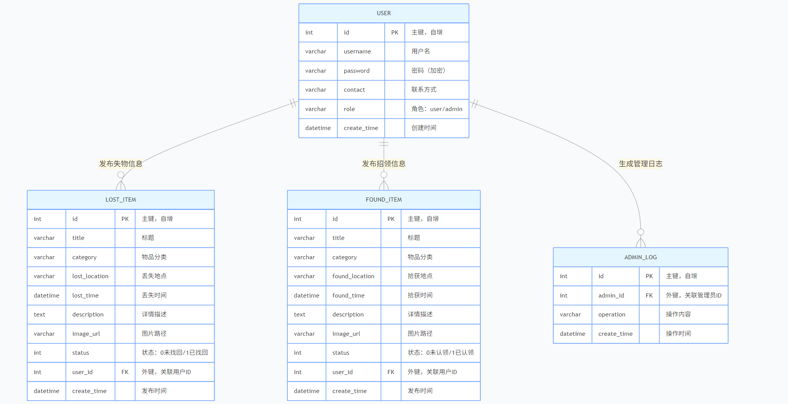

## 6. API 设计与前后端协同

### 6.1 接口设计原则

接口设计阶段的重点是统一路径、请求方法、鉴权方式和前后端协作模式。我们采用了 REST 风格接口，并统一使用 JWT Bearer 认证。前端通过 Axios 请求拦截器自动附加 `Authorization: Bearer {token}` 请求头，后端通过 `JwtFilter` 解析 Token 并将用户名、角色写入请求上下文，保证前后端对认证机制的理解一致。

### 6.2 当前实现的核心接口

负责人：孔欣然

根据当前代码，系统已经实现以下主要接口组：

1. 用户认证接口：`/api/register`、`/api/login`
2. 用户信息接口：`/api/profile`、`/api/user/update-username`、`/api/user/update-password`
3. 失物接口：`/lost_item`、`/lost_item/{id}`、`/lost_item/{id}/status`
4. 招领接口：`/found_item`、`/found_item/{id}`、`/found_item/{id}/status`、`/found_item/my`
5. 管理员接口：`/api/admin/stats`、`/api/admin/users`、`/api/admin/lost-items`、`/api/admin/found-items`、`/api/admin/users/{id}/role`
6. AI 接口：`/ai/match-lost/{lostId}`、`/ai/match-found/{foundId}`
7. 监控接口：`/health`、`/metrics`、`/actuator/health`

### 6.3 前后端协作方式

负责人：孔欣然、王琰

为了支持并行开发，前端在接口设计作业阶段先完成了模块化 API 封装，并通过统一请求层处理认证、错误提示和跳转逻辑。后端则依据约定路径完成控制器实现。这样做的好处在于，一旦请求路径和字段确定，前后端可以分别开发并在后期集中联调，而不需要每次都回到页面里重写请求逻辑。

## 7. 前端实现

负责人：王琰

### 7.1 页面实现情况

当前前端已经实现以下页面：

1. 登录页与注册页：支持基础表单校验和登录状态处理。
2. 首页：作为系统入口页面，提供失物与招领信息浏览入口。
3. 失物列表页与招领列表页：支持查询、筛选、详情跳转。
4. 失物详情页与招领详情页：展示完整字段信息，并根据用户身份控制按钮显示。
5. 发布页与编辑页：支持发布失物、发布招领以及修改已发布内容。
6. 个人中心页：展示当前用户身份信息和发布记录管理入口。
7. 管理员页面：提供用户管理、失物管理、招领管理与统计信息查看能力。

### 7.2 前端关键实现思路

前端实现并非简单拼接页面，而是围绕复用性和可维护性组织代码。具体来说，系统将 Axios 请求能力统一封装在 `src/api/axios.js` 中，将登录过期、认证失败、错误提示等逻辑集中处理。列表页则通过计算属性或接口筛选参数实现多条件过滤，不把复杂逻辑散落到模板中。管理员相关页面沿用统一的页面结构和表格交互，以减少重复实现。

### 7.3 交互与用户体验

在交互方面，系统重视基础可用性。例如：

- 未登录访问受保护页面会自动跳转到登录页；
- 请求返回 401 时会统一提示并强制回到登录页；
- 列表、详情、发布、编辑之间的跳转关系清晰，避免用户迷失；
- AI 匹配操作放在详情页中，以减少用户理解成本。

- 登录页实际运行效果
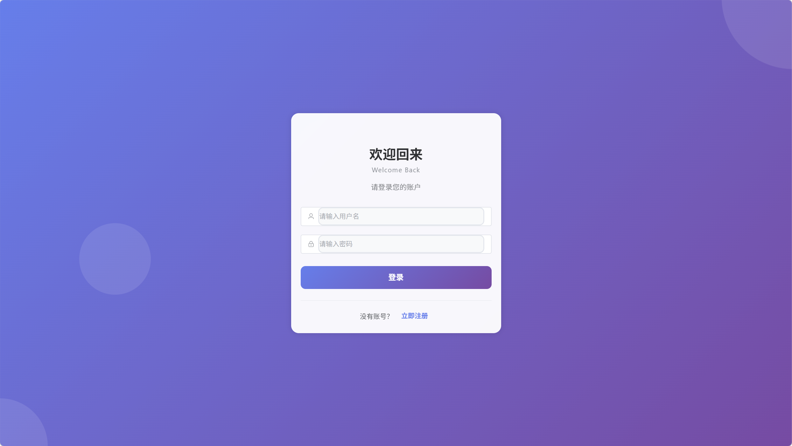
- 失物列表页实际运行效果
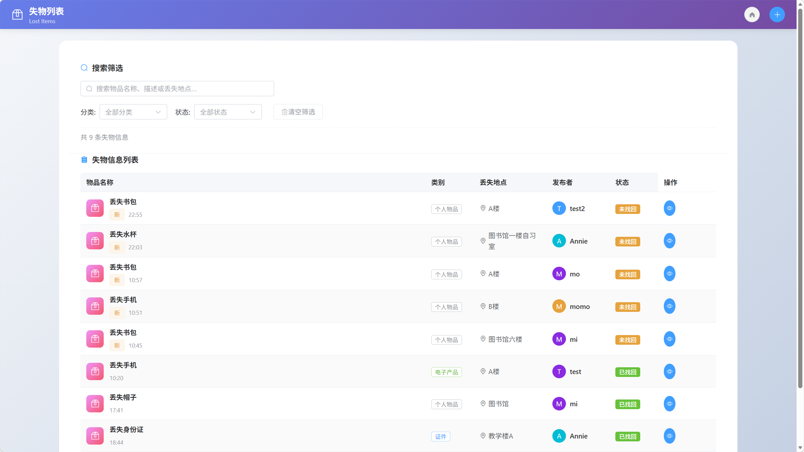
- 招领列表页实际运行效果
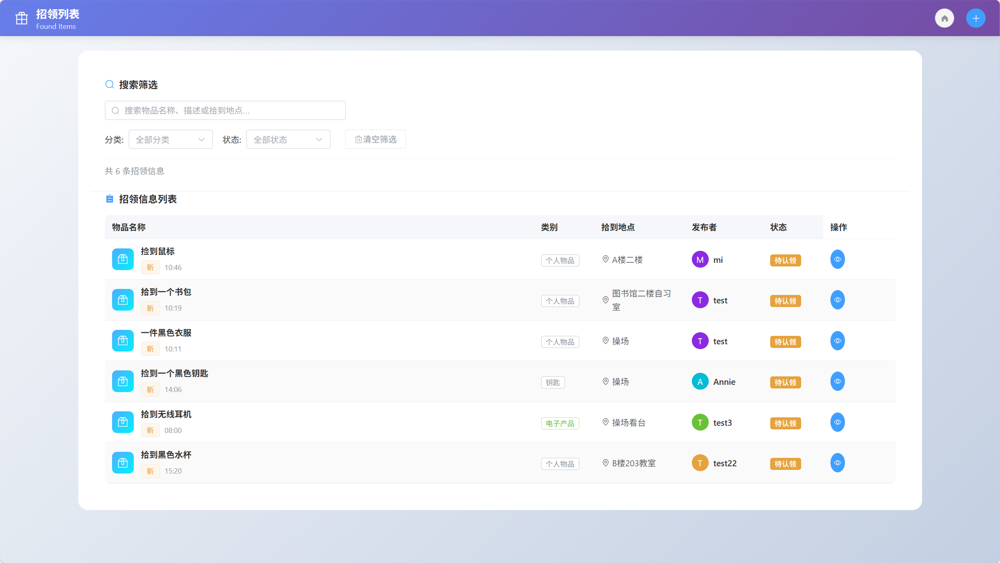
- 失物招领详情页实际运行效果
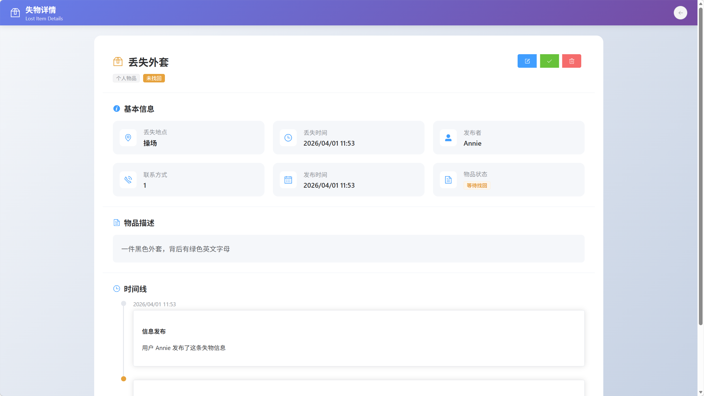
- 个人中心实际运行效果
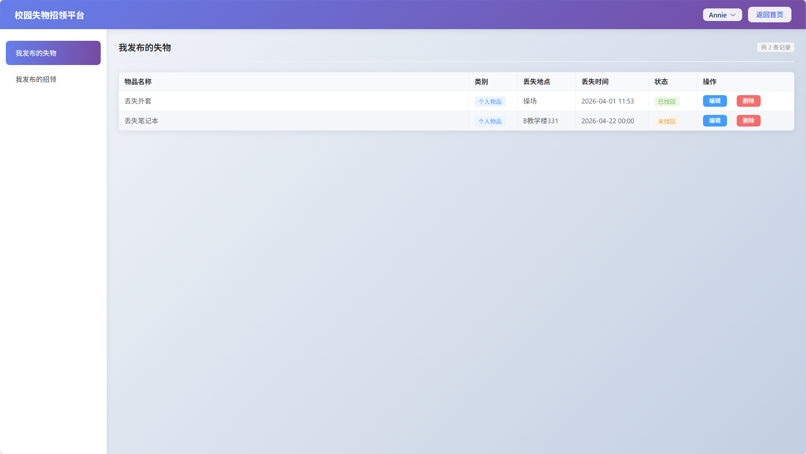
- 系统管理页实际运行效果
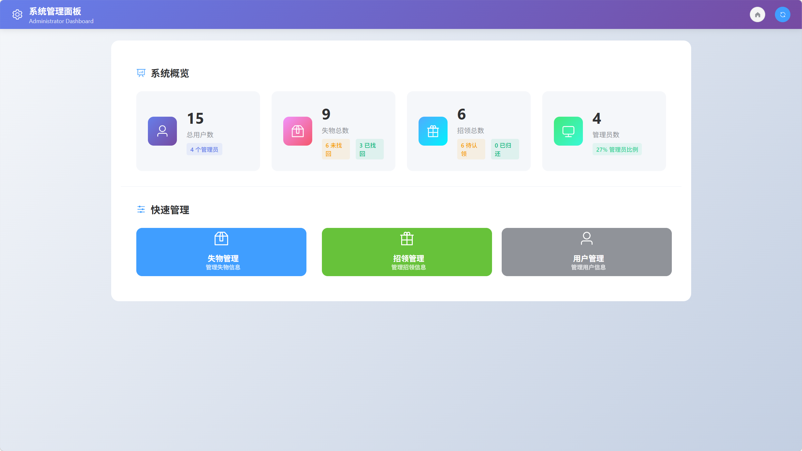
- 系用户管理页实际运行效果
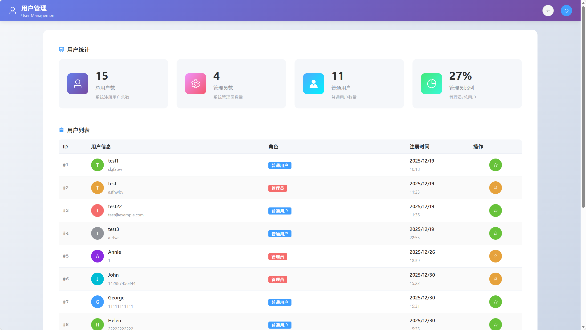

## 8. 后端实现

负责人：孔欣然

### 8.1 用户与认证模块

后端的用户模块完成了注册、登录、修改用户名、修改密码和获取个人资料等功能。注册时通过 `BCryptPasswordEncoder` 对密码进行加密，登录成功后由 `JwtUtils` 生成 Token。认证并不是保存在服务器 Session 中，而是通过 JWT 实现无状态鉴权，这样更适合前后端分离应用。

### 8.2 失物与招领业务模块

失物与招领模块是系统核心。两类业务都支持创建、修改、删除、查看列表、查看详情和更新状态。为了保证基本权限边界，业务层在修改、删除和状态更新时都验证了资源所有权，普通用户只能操作自己发布的内容。还支持根据关键词、分类和状态进行动态查询，以增强信息检索能力。

### 8.3 管理员模块

管理员模块承担平台管理职责，主要提供四类能力：查看系统统计信息、查看全部失物、查看全部招领、查看全部用户，以及删除违规信息和调整用户角色。管理员权限并不是通过前端页面隐藏来保证，而是由后端在 `AdminController` 中校验当前用户角色为 `admin` 后才允许执行。

### 8.4 工程实现特点

1. 使用 JPA Repository 简化 CRUD 与统计查询实现。
2. 使用独立的 Service 层承载业务规则，避免控制器过度膨胀。
3. 使用 Spring Security 和自定义 JWT 过滤器完成接口认证。
4. 保留健康检查与指标接口，为后续 Docker 和监控作业提供基础。

## 9. AI 功能集成

负责人：王琰

### 9.1 功能目标

AI 功能不是独立聊天窗口，而是围绕项目主业务设计的“智能失物匹配助手”。用户在失物详情页可以尝试匹配已有招领信息，在招领详情页也可以尝试反向匹配可能的失主，从而提升信息检索效率。

### 9.2 实现方式

后端通过 `AIController` 提供两个接口：`/ai/match-lost/{lostId}` 和 `/ai/match-found/{foundId}`。当接口被调用时，系统会先从数据库中读取当前物品和候选列表，然后构造提示词，请求 DeepSeek Chat API 返回匹配建议。前端通过 `AIMatchButton.vue` 封装复用按钮和弹窗逻辑，使 AI 功能能够在两个业务场景中重复使用。

### 9.3 本阶段的价值与局限

AI 功能的价值在于它真正服务于主业务流程，而不是为了接入模型而接入模型。与此同时，我们也清楚认识到当前实现仍然依赖提示词稳定性和外部接口返回结果，因此系统对异常情况增加了加载状态、失败提示和格式解析保护，避免把 AI 的不稳定性直接暴露给用户。

- AI 匹配弹窗结果

## 10. 软件测试

负责人：孔欣然、王琰

### 10.1 测试目标

测试阶段的核心目标是验证系统是否不仅“能跑”，而且“改动后仍然相对稳定”。因此我们分别在前端和后端建立了自动化测试集。

### 10.2 前端测试

负责人：王琰

当前前端目录下共有 21 个 `spec` 测试文件，覆盖 API 层、组件层、页面层和根组件层。测试框架使用 Vitest，重点验证以下内容：

1. 登录、注册、发布、编辑等核心业务流程；
2. 列表渲染、详情展示、路由跳转与表单校验；
3. Axios 请求成功和失败时的交互反馈；
4. 管理员页面、AI 按钮、错误提示等特殊场景；
5. 本地存储、路由和 Element Plus 组件的 Mock 行为。

根据当前测试目录统计，前端测试文件数为 21 个，测试代码中出现的测试定义约 210 处，说明测试已覆盖多个交互场景，而不是只验证最表面的页面加载。

### 10.3 后端测试

负责人：孔欣然

当前后端目录下共有 7 个测试文件，其中包括 6 个业务测试文件和 1 个上下文加载测试文件。后端测试主要覆盖：

1. Service 层业务逻辑测试，如发布、修改、删除、状态更新和权限校验；
2. Controller 层接口测试，如用户接口、失物接口、招领接口和管理员接口；
3. Spring Boot 应用上下文加载测试；
4. 基于 MockBean 和 Mockito 的依赖模拟，避免测试直接依赖真实外部服务。

根据当前测试代码统计，后端 `@Test` 标注共 54 个，测试范围已经从单点逻辑扩展到核心业务流程。

### 10.4 测试结果

- 前端测试运行结果
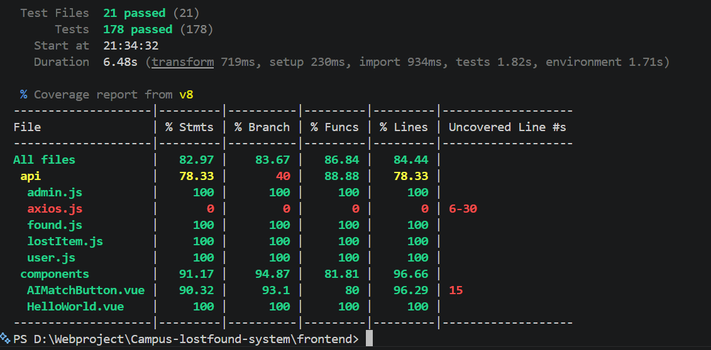
- 后端测试运行结果
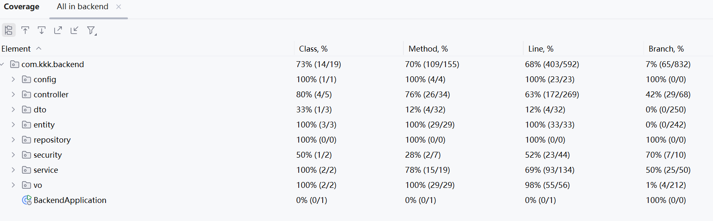

## 11. CI/CD 配置

负责人：孔欣然、王琰

### 11.1 CI 工作流设计

项目使用 GitHub Actions 作为持续集成平台。当前仓库中的 `ci.yml` 工作流会在 `push` 和 `pull_request` 到 `main`、`develop`分支时触发。工作流将前后端分成独立 job 执行：后端使用 JDK 17 和 Maven 运行测试与 JaCoCo 覆盖率生成，前端使用 Node 环境执行依赖安装、Lint 和 Vitest 测试。

### 11.2 覆盖率与产物

CI 并不仅仅负责“判断通过或失败”，还承担了测试产物输出的作用。前后端都集成了覆盖率生成和上传流程，便于后续回溯问题来源。这样一来，当某次提交导致测试失败时，团队成员不需要重复在本地猜测失败原因，而可以直接根据 CI 日志和产物定位问题。

### 11.3 本阶段的工程价值

CI/CD 作业让项目从“本地能运行”走向“远程能稳定验证”。它把个人开发行为转化为团队协作流程，保证每次合并都经过同样的检查标准。

- GitHub Actions CI 通过页面

- 截图占位：覆盖率徽章
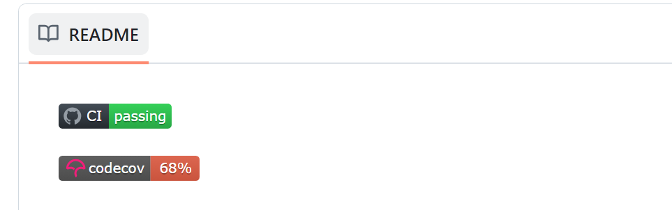

## 12. 安全设计与审查

负责人：孔欣然、王琰

### 12.1 已落实的安全措施

根据当前代码与配置，系统已经实现以下安全措施：

1. 密码不明文存储，而是使用 BCrypt 加密。
2. 登录后使用 JWT 进行无状态认证，并设置过期时间。
3. 非白名单接口默认需要认证访问。
4. 用户修改、删除和更新状态时存在资源所有权校验。
5. 仓库提供 `.env.example` 模板，并使用 `.gitignore` 避免敏感环境文件直接提交。
6. 使用 `security.yml` 工作流集成 Gitleaks，对仓库进行密钥泄露扫描。

## 13. Docker 部署

负责人：孔欣然、王琰

### 13.1 容器化思路

Docker 部署阶段的目标是把前端、后端和数据库从“本地开发项目”转变为“可被统一编排的服务”。我们没有将全部内容塞进同一个容器，而是采用三个独立服务：

1. 前端容器：由 Vue 项目构建静态资源，并由 Nginx 提供访问；
2. 后端容器：由 Spring Boot 打包生成可运行的 Jar；
3. 数据库容器：使用 MySQL 8.0 提供数据存储。

### 13.2 当前实现方式

1. `compose.yaml`：用于开发环境，包含前端、后端、数据库三个服务；
2. `compose.prod.yaml`：用于生产或接近生产的环境，前后端镜像从 GHCR 拉取，数据库密码通过 Docker secrets 管理；
3. `docker-compose.test.yaml`：用于 GitHub Actions 中的容器联调测试。

### 13.3 前后端镜像设计

前端镜像使用多阶段构建，先通过 Node 构建静态资源，再通过 Nginx 运行时镜像对外提供服务，并在 `nginx.conf` 中处理 SPA 路由回退和 `/health` 探活。后端镜像同样采用多阶段构建，先在 Maven 环境中打包，再在 JRE 运行镜像中执行 `app.jar`。这种方式可以减少最终镜像体积，也让运行环境更聚焦于真正需要的依赖。

### 13.4 自动化部署验证

项目的 `docker.yml` 工作流在主分支推送时会构建前后端镜像并推送到 GHCR，然后用 `docker-compose.test.yaml` 拉起测试栈，等待 `db`、`backend`、`frontend` 都通过健康检查，再通过 `curl` 验证前端入口和后端健康接口。这意味着 Docker 作业不只停留在“写了 Dockerfile”，而是真正进入自动化联调阶段。

- 前端页面访问结果
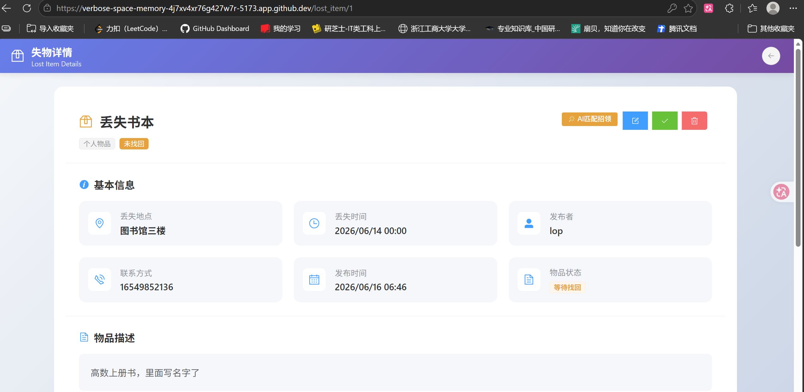
- GitHub Actions 中 Docker 工作流通过页面

## 14. 监控与可观测性

### 14.1 后端监控

负责人：孔欣然

后端已经实现基础监控能力，包括：

1. 使用 `logstash-logback-encoder` 输出结构化 JSON 日志；
2. 提供 `/health` 自定义健康检查接口；
3. 提供 `/metrics` 指标接口，返回累计请求数、错误请求数、错误率与平均响应时间；
4. 通过 `MetricsFilter` 对每次请求记录响应状态与耗时。

- `/health` 接口返回结果

- `/metrics` 接口返回结果

- 结构化日志输出
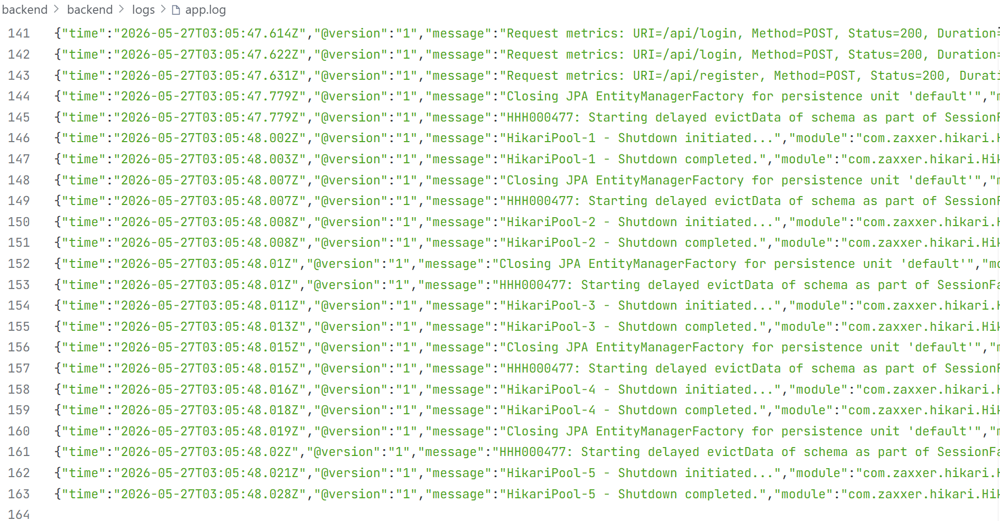

### 14.2 前端监控

负责人：王琰

前端监控主要体现在两个方面：一是通过 `logger.js` 统一输出 JSON 格式日志，二是在前端容器的 Nginx 中配置 `/health` 端点，以配合容器编排和 CI 健康检查使用。虽然这是基础级别的可观测性，而不是完整的日志采集平台，但它已经满足课程项目对“可检测、可定位、可排查”的工程要求。

## 15. 项目总结与不足

负责人：共同完成

### 15.1 项目成果总结

回顾整个课程周期，本项目较完整地经历了一个软件系统从需求到交付的全过程。我们不仅实现了校园失物招领系统的核心业务功能，还围绕工程化要求补齐了自动化测试、持续集成、安全检查、容器化部署和基础监控。这种从“功能开发”扩展到“系统工程”的过程，是本次课程最重要的训练价值。

### 15.2 当前已完成的核心能力

1. 已完成基于 Vue 3 和 Spring Boot 的前后端分离实现；
2. 已完成用户、失物、招领、管理员、AI 匹配、监控等核心功能；
3. 已完成前后端自动化测试；
4. 已完成 GitHub Actions CI、Gitleaks 安全扫描和 Docker 自动化联调；
5. 已完成基础结构化日志、健康检查与指标收集。

### 15.3 仍可继续完善的内容

1. 当前错误处理风格仍不完全统一，后续可以继续引入更规范的全局异常处理机制。
2. AI 功能仍依赖外部模型返回格式，结果稳定性有进一步优化空间。
3. Docker 与 CI 联调中暴露出的镜像环境兼容问题，后续仍需要持续检查和维护。
4. 当前监控仍属于基础级别，未来可以继续引入更完整的日志采集、指标可视化和告警体系。
